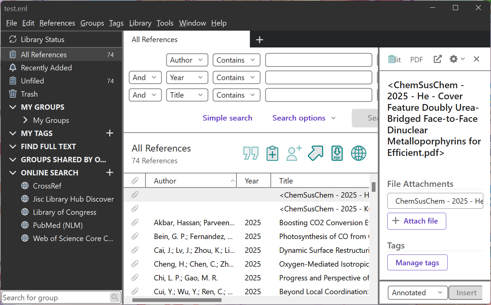
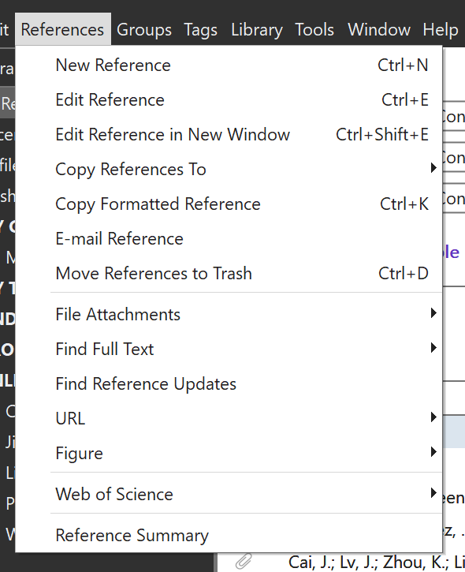
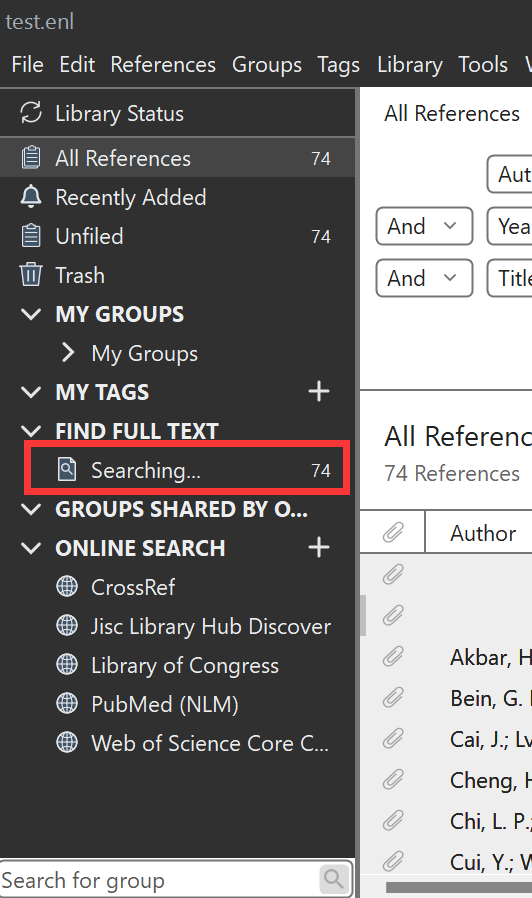

# EndNote 使用指南：FindFullText 功能入门
软件名：EndNote
版本：2024

## 步骤1：打开文件

首先，我们需要打开 EndNote 软件。

- 双击桌面上的 EndNote 图标
- 或者通过开始菜单搜索并打开 EndNote

打开后，你将看到主界面如下所示：

## 步骤2：点击References菜单

在 EndNote 主界面顶部菜单栏中，找到并点击 "References" 菜单。

点击完成后，会出现一个下拉菜单。

## 步骤3：在下拉菜单中选择 "Find Full Text"

在 "References" 菜单的下拉选项中，找到并点击 "Find Full Text" 选项。

成功点击后，会出现一个子菜单，选择 "Find Full Text" 选项。

## 步骤4：查看查找进度

点击 "Find Full Text" 后，EndNote 左侧的边栏将显示正在查找全文的进度。

## 完成

当进度已经成功显示，表示 EndNote 正在为你的参考文献查找全文。你可以等待查找完成，或者继续进行其他操作。
